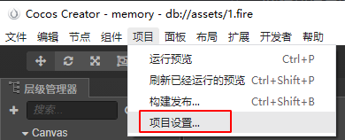
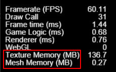

资源自动释放模块

## 释放原理

监控资源的使用情况，在规定的帧数之内，资源如果没有被使用，则自动释放资源。

### 举例：

gc模块设置的阈值为5，即资源在5帧内没有被使用，则自动释放。

节点使用到了资源`a.png`

- 在游戏的第10帧该节点添加到场景，也就是资源`a.png`被使用了

- 在游戏的第20帧该节点从场景中移除，对应的资源`a.png`的最后使用帧为20

- 在游戏的第25帧，资源`a.png`会被释放。

## 接入/使用 准备

gc模块需要自定义JS引擎

1. 下载自定义引擎 http://192.168.1.39:8080/svn/creatorEngine/resources/engine


2. 打开项目设置

    

3. 设置`JavaScript引擎路径`后，并`保存`设置

    
    
4. 重启creator自动编译JavaScript引擎。

## 接入/使用 说明


- 初始化
    ```js
    cc.gc && cc.gc.init({
        // 是否开启GC
        enable: true,
        // 当游戏的纹理内存超过上限，就会触发gc行为，单位MB，默认500MB
        memoryLimit: 500,
        // 每多少帧进行一次gc操作, <=0 意味着每一帧都会进行一次GC
        cycleFrame: 0,
        // 资源是否开启GC
        assetEnable: true,
        // 每次GC时，释放的资源数量上限，防止一帧发生大量GC导致卡顿
        assetLimitCount: 1,
        // 资源多少帧未使用，自动释放该资源
        assetLifeFrame: 10,
        // remove节点是否开启GC，因为会带来额外的性能消耗，目前只会在CC_DEBUG环境才会进行检测。
        // 查看处于游离态的节点: cc.pool.removeNodes.log()
        removeNodeEnable: false,
        // 每次GC时，释放的节点数量上限
        removeNodeLimitCount: 1,
        // 使用remove删除的节点多少帧后没有再次添加到场景中，自动释放该节点
        removeNodeLifeFrame: 10,
    });
    ```

- 动态设置是否启用GC
    ```js
    cc.gc && cc.gc.enable(true);
    ```
## 查看游戏的纹理内存大小
```js
cc.debug.setDisplayStats(true)
```

显示`Profile`即可看到`TextureMemory`信息



## 预加载注意事项
在预加载过程中，有时我们需要加载比较多的资源，但是这些资源并不会立刻被使用。

为了防止这些资源被GC掉，GC模块提供了`gc.protectAsset(asset, true)`方法，可以手动对资源进行保护，告诉GC模块，暂时跳过对该资源的GC操作。

一定要记得`gc.protectAsset(asset, false)`，否则GC模块将无法自动释放资源。

> 取消保护并不意味着会被立刻被GC，同样需要满足GC的原理。

### 举例
```js
// 伪代码，仅仅是为了说明使用场景
scene.enter = ()=>{
    cc.loader.loadRes("a.png",(err, asset)=>{
        scene.preloadAsset = asset;
        cc.gc && cc.gc.protectAsset(asset, true);
    })
}
// 伪代码，仅仅是为了说明使用场景
scene.exit = ()=>{
    cc.gc && cc.gc.protectAsset(scene.preloadAsset, false);
}
```
## 动态加载DragonBones注意事项
动态创建DragonBones是需要动态加载2个资源，需要2次load的过程，需要对这两个资源进行保护，防止在加载过程中被GC掉。

```js
function createDB(asset_tex, asset_ske){
     // 异步创建dragonBones，这里仅仅是举例说明
     setTimeout(()=>{
        const db = new cc.Node("db");
        const comp = db.addComponent(dragonBones.ArmatureDisplay);
        comp.dragonAsset = asset_ske;
        comp.dragonAtlasAsset = asset_tex;
        
        // 一定要记得取消gc的保护，否则gc将无法自动释放相关资源
        cc.gc && cc.gc.protectAsset(asset_tex, false); 
        cc.gc && cc.gc.protectAsset(asset_ske, false); 
     }, 1000);
}

cc.loader.loadRes(tex,(error, asset_tex)=>{
    // 此时asset_tex并不会被释放，调用这个api的原因就是为了防止gc释放掉
    cc.gc && cc.gc.protectAsset(asset_tex, true);
    cc.loader.loadRes(ske, (error, asset_ske)=>{
        // 如果createDB中创建dragonBones没有异步逻辑，可以取消对asset_ske的保护
        cc.gc && cc.gc.protectAsset(asset_ske, true);
        // 因为load ske需要时间，如果这段时间刚好触发gc，就会将之前的asset_tex释放掉
        createDB(asset_tex, asset_ske);
    })
})
```
## 动态加载Spine注意事项
因为spine只需要动态加载一个资源，所以不需要对资源进行保护。
```js
cc.loader.loadRes(`spine/raptor-pro`, sp.SkeletonData, (error: Error, asset: sp.SkeletonData) => {
    if (error) {
        console.log(error);
        return;
    }
    // cc.gc && cc.gc.protectAsset(asset, true); // 不需要
    const node = new cc.Node("spine");
    const spineComp = node.addComponent(sp.Skeleton);
    spineComp.skeletonData = asset;
    spineComp.animation = "walk";
    spineComp.loop = true;
    node.scale = 0.2;
    scene.addChild(node);
});
```

## 资源使用特别注意事项

`动态加载`后，将资源赋值给一个变量
```js
let handleSpriteFrame = null;
cc.loader.loadRes("a.png",cc.SpriteFrame, (err, asset)=>{
    handleSpriteFrame = asset; // 其他Object引用了该资源
})
```
如果`asset`没有被保护，`或者`没有被使用(`sprite.spriteFrame = handleSpriteFrame`)，当触发GC时，该资源就会被自动释放。

后续如果直接又拿来使用，就会出现问题。
```js
const node = new cc.Node();
const sprite = node.addComponent(cc.Sprite);
sprite.spriteFrame = handleSpriteFrame; // 此时spriteFrame已经被释放了，会导致渲染异常
```

目前底层没有合适的方法感知到资源被变量引用的情况，可以通过`JS Proxy`追踪到这种变量之间的相互引用。

## 关于remove相关api的注意事项

在creator中，需要特别注意一些api
- node.removeFromParent()
- node.removeAllChildren()
- node.removeChild()
- node.removeChildByTag()

此类相关api仅仅是将node从场景中移除，但是并不会释放相关的内存，如果这些node没有被再次添加到场景中，那么这些node就会一直处于游离状态，`一直占用相关的内存`，直到主动调用`node.destroy()`。

gc模块在`CC_DEBUG`模式下，提供了对游离状态节点的监控，可以通过`cc.pool.removeNodes.log()`查看。


gc模块同时也提供了对这些游离状态节点的自动释放功能，`removeNodeEnable`选项正是为此而设计的。

出于性能考虑目前仅在`CC_DEBUG`模式下生效，在正式发布版本时，请确保已经管理好游离状态的节点。


## 目前支持GC的资源类型
-  cc.Prefab 
-  cc.Texture2D  
-  cc.SpriteFrame 
-  cc.SpriteAtlas
-  cc.AnimationClip
-  dragonBones.DragonBonesAsset 
-  dragonBones.DragonBonesAtlasAsset 
-  sp.SkeletonData
  
## 资源引用计数查看

gc模块提供了简单的的引用计数查看


### frame

游戏当前运行到的帧数

### dynamic0：（重点关注）

动态引用计数为0的资源，如果dynamicRef=0，但是没有释放，此时的staticRef肯定不为0，也就是说该资源在游戏制作过程中，被prefab/scene上的脚本所引用。

分2种情况：
- 制作prefab时，Sprite等内置组件引用了`asset`，这种情况暂时没有更好的解决办法。
- `prefab/scene`中有个`property(CC.Asset)`指向了asset， 解决办法：将该资源改为使用`cc.loader.load`加载。


### static0

静态引用计数为0的资源，这里面的大部分资源都是通过`cc.loader.load`加载的游戏资源。

### static0_dynamic0

静态引用动态引用都为0的资源，这里面的大部分资源的frame都和游戏的当前帧一致，一般plist资源居多。


### project

非`internal`的游戏资源。